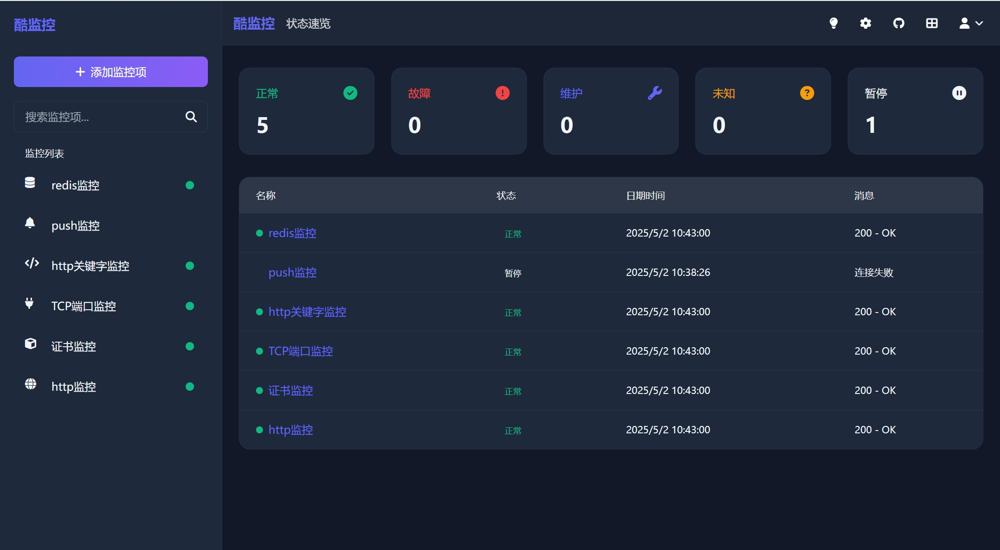
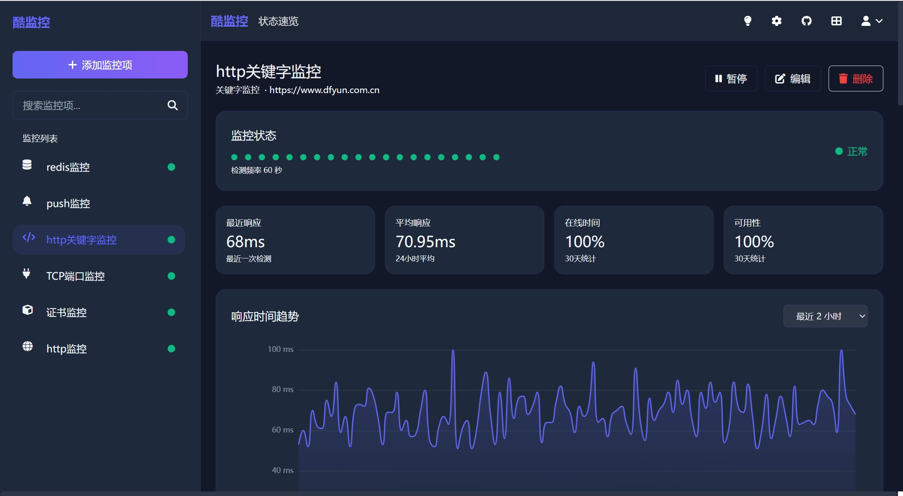
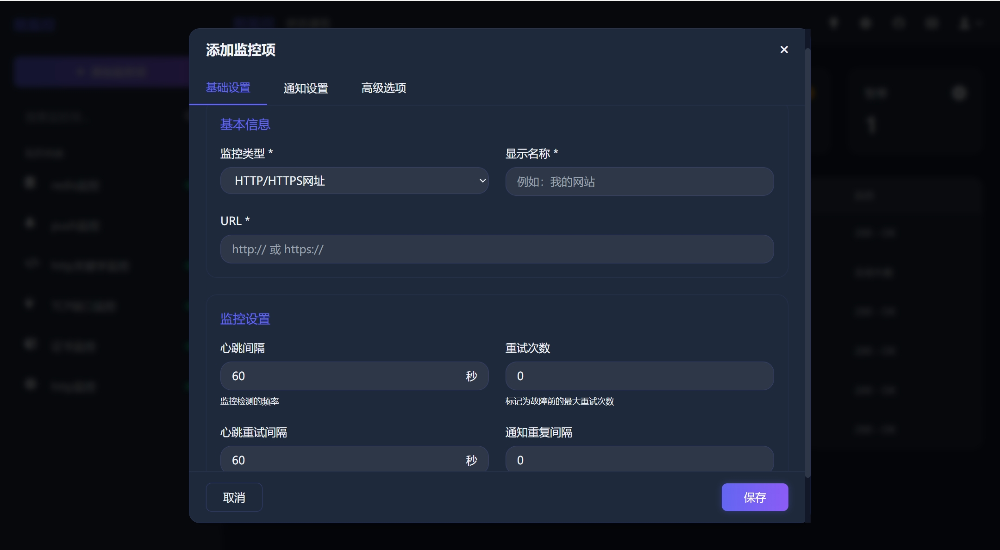
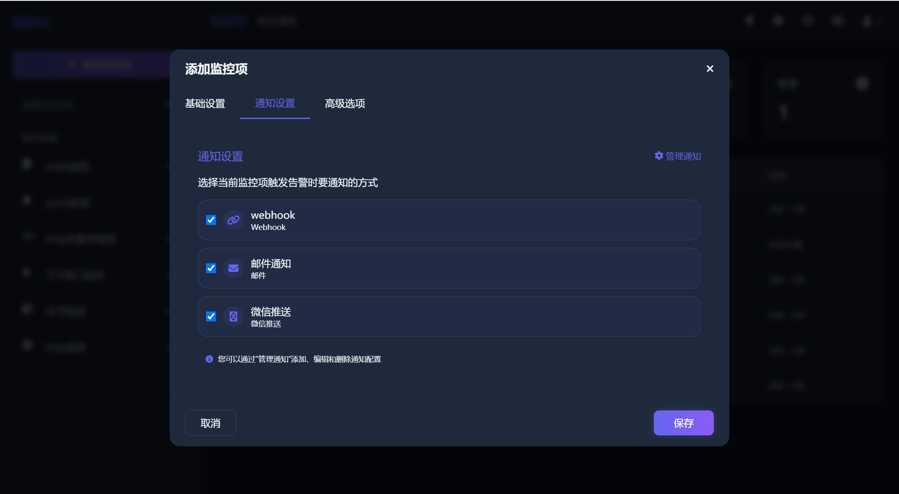

# 酷监控 | 高颜值的监控工具

酷监控是一个高颜值的监控工具，支持网站监控/接口监控/HTTPS证书监控等多种监控类型，帮助开发者及运维人员实时掌握网站/接口运行状态。本项目支持Docker一键快速部署，拥有美观现代的界面设计。


## 🚀 功能特点

* **多种监控类型**：支持HTTP/HTTPS网站、API接口、HTTPS证书过期、TCP端口、MySQL/Redis数据库等多种监控
* **推送监控**：支持被动接收客户端的心跳推送，实现不可直接访问设备的监控
* **精美界面**：深色/浅色主题切换，响应式设计适配各种设备尺寸
* **强大通知系统**：支持邮件、Webhook、微信通知渠道等多种通知方式
* **数据可视化**：直观的状态图表和分析功能，快速了解系统运行状况
* **持久化存储**：使用SQLite数据库，轻量级部署无需额外依赖

## 📸 截图预览

### 控制台主界面


### 单个监控项详情页


### 添加监控


### 通知设置


## 🔧 监控类型

* **HTTP/HTTPS网站监控**：检查网站可用性和响应时间
* **HTTPS证书监控**：检查SSL证书过期时间，提前预警
* **关键词监控**：检查网页内容是否包含特定关键词
* **TCP端口监控**：检查端口是否开放
* **MySQL/MariaDB数据库监控**：检查数据库连接和基本查询
* **Redis数据库监控**：检查Redis服务状态
* **推送监控**：被动接收客户端的心跳推送

## 🛠️ 技术栈

* **前端框架**：Next.js 
* **后端**：Next.js API Routes
* **数据库**：SQLite (通过Prisma ORM)
* **UI库**：TailwindCSS
* **图表库**：ECharts
* **认证**：NextAuth.js
* **计划任务**：Croner

## 📦 安装与部署

### Railway 一键部署（最简单）

[](https://railway.com/deploy/GAsUJY?referralCode=vip)

**3 步完成：**
1. 点击上方按钮（如未注册会自动引导注册）
2. 点击 **Deploy Now** 开始部署
3. 部署完成后添加 Volume：**Settings → Volumes → Mount Path: `/app/data`, Size: 1GB**

> ✅ 无需 Fork 仓库，无需配置，真正的一键部署！

详细说明：[Railway 部署文档](./DEPLOY_RAILWAY.md)

---

### 使用Docker部署（推荐）

使用Docker是运行酷监控最简单的方式：

```bash
# 适用于x86/x64架构
docker run -d --name coolmonitor --restart always -p 3333:3333 -v ~/coolmonitor_data:/app/data star7th/coolmonitor:latest

# 适用于ARM架构（如树莓派、Apple Silicon）
docker run -d --name coolmonitor --restart always -p 3333:3333 -v ~/coolmonitor_data:/app/data star7th/coolmonitor:arm-latest
```


### 初始化说明

首次启动时，系统会自动：
1. 检查数据库是否存在
   - 如果存在预置的数据库，则直接使用
   - 如果不存在，则自动初始化数据库结构
2. 首次访问时，系统会引导你创建管理员账户

访问 http://localhost:3333 开始使用酷监控。

## 🔄 更新说明

### Docker部署更新

如果您使用Docker部署，更新到最新版本需要执行以下步骤：

```bash
# 1. 停止当前运行的容器
docker stop coolmonitor

# 2. 删除旧容器（数据会保留在挂载的卷中）
docker rm coolmonitor

# 3. 拉取最新镜像
docker pull star7th/coolmonitor:latest
# 或者对于ARM架构
docker pull star7th/coolmonitor:arm-latest

# 4. 重新运行容器
docker run -d --name coolmonitor --restart always -p 3333:3333 -v ~/coolmonitor_data:/app/data star7th/coolmonitor:latest
```

**注意事项：**
- 更新过程中，你的监控数据和配置会保留在挂载的数据卷中
- 建议在更新前备份重要数据
- 更新后首次启动可能需要几秒或者几十秒时间进行数据库迁移

## 🧩 项目结构

```
coolmonitor/
├── src/
│   ├── app/                - Next.js应用目录
│   │   ├── dashboard/      - 监控面板
│   │   ├── auth/           - 用户认证
│   │   └── api/            - API接口
│   ├── components/         - 可复用组件
│   ├── lib/                - 工具函数和库
│   │   ├── monitors/       - 监控检查器实现
│   │   ├── database-upgrader.ts - 数据库升级工具
│   │   └── system-init.ts  - 系统初始化
│   ├── hooks/              - 自定义Hook
│   ├── context/            - React上下文
│   └── types/              - TypeScript类型定义
└── prisma/                 - 数据库模型和迁移
```

## 🌍 贡献指南

欢迎贡献代码！请随时提交Pull Request。

1. Fork仓库
2. 创建功能分支 (`git checkout -b feature/amazing-feature`)
3. 提交更改 (`git commit -m '添加某项惊人功能'`)
4. 推送到分支 (`git push origin feature/amazing-feature`)
5. 打开Pull Request

## 📄 许可证

本项目基于Apache License 2.0许可证开源 - 详情请查看 LICENSE 文件。

## 🔗 链接

* GitHub仓库: https://github.com/star7th/coolmonitor
